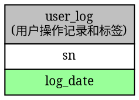

```dot
digraph {
    node [fontname="SimSun" fontsize=10];
    edge [fontname="SimSun" fontsize=10];
    node [shape=none fontsize=10 margin=0];
    
    user_log [ label=<
        <table BORDER="0" CELLBORDER="1" CELLSPACING="0" CELLPADDING="4">
            <tr>
                <td bgcolor="gray">user_log<br/>(用户操作记录和标签)</td>
            </tr>
            <tr><td>sn</td></tr>
            <tr><td bgcolor="#99ff99">log_date</td></tr>
        </table>
    > ]
}
```

## 参考
* [Documentation](http://www.graphviz.org/Documentation.php)